# Docker

Основано на [видео](https://www.youtube.com/watch?v=O8N1lvkIjig)

Лицензия Apache 2.0

> Commercial use of Docker Desktop in larger enterprises (more than 250 employees OR more than $10 million USD in annual revenue) requires a paid subscription.

Темы, которые рассматриваются в [курсе](https://www.youtube.com/watch?v=O8N1lvkIjig):

    1. Основы Docker
    2. Установка на Windows и Linux
    3. Основные команды
    4. Port mapping
    5. Environment variables
    6. Постоянные данные (Docker volumes)
    7. Сети в Docker
    8. Создание своих контейнеров (Dockerfile)
    9. Docker compose. Применение
    10. Portainer — web UI для управления Docker
    

## Основы Docker

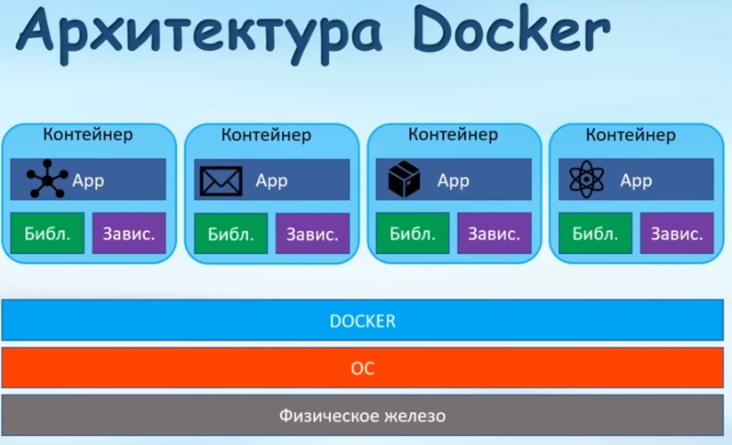

Docker работает только под Линуксом

### Docker или виртуальная машина?

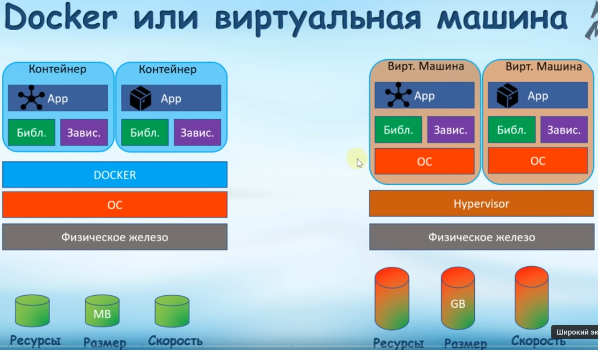

**VirtualBox** это hypervisor

Docker требует меньше ресурсов.

В реальности на серверах оба эти подхода сочетаются

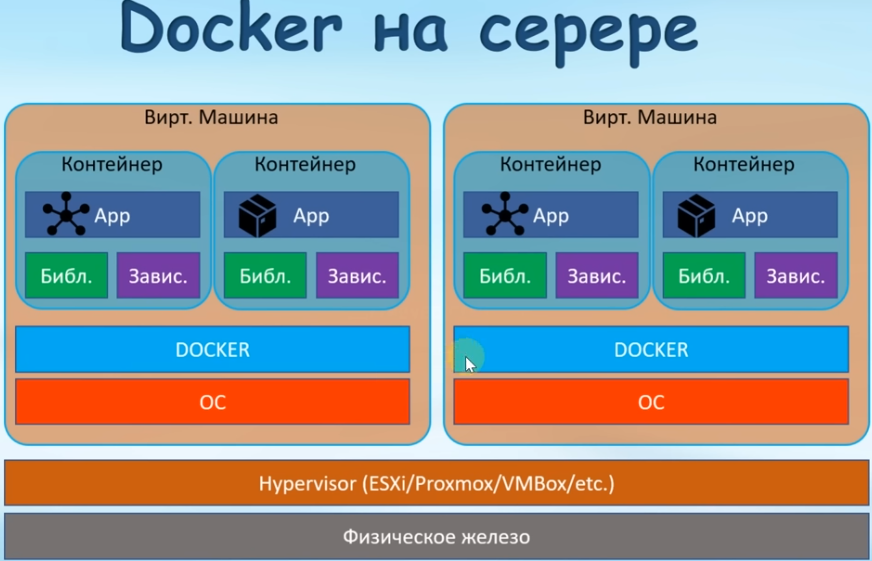

Гипервизоры объединены в кластеры. Если один из серверов не работает, то контейнеры продолжают работать на других серверах.

### Упрощение разработки и развертывания приложения

Упрощается взаимодействие программистов с operations team. 

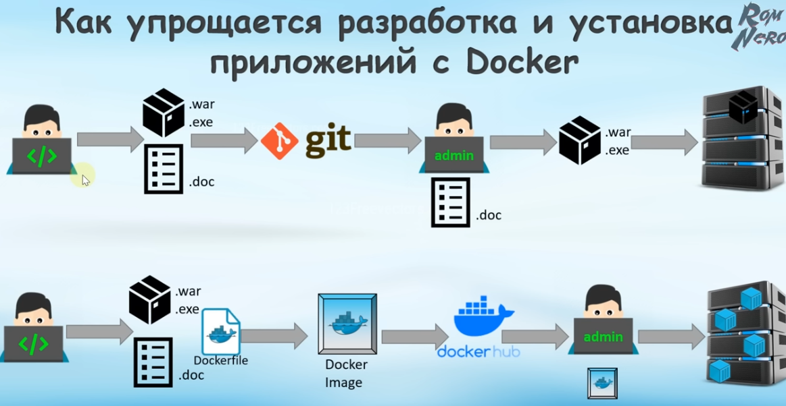

Если при тестировании приложение будет работать в контейнере, то оно будет работать везде.

### Docker image, registry & container

На docker registry находятся images. Для создания контейнера на сервере из одного из этих images нам нужно

Dockerhub - извесный registry

```
docker pull [image name] # Скачать image в локальный registry
# Запуск приложения внутри контейнера, используя данный образ
# Если имя не указано, образ будет скачан автоматически
docker run [image name] 

```

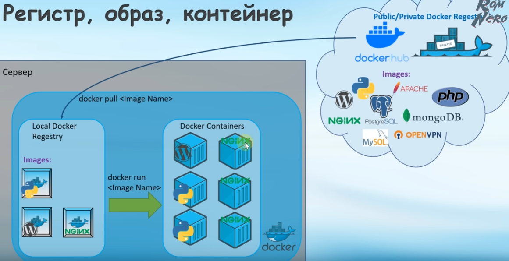

### Отличие образов от контейнеров

[Источник](https://aws.amazon.com/ru/compare/the-difference-between-docker-images-and-containers/)

> Класс и экземпляр

Контейнер Docker – это автономное запускаемое программное приложение или сервис. С другой стороны, образ Docker – это шаблон, загруженный в контейнер для его запуска, например набор инструкций.

Вы храните образы для совместного и повторного использования, но создаете и уничтожаете контейнеры в течение жизненного цикла приложения. Далее мы приведем больше отличий.
Источник

Вы создаете образ Docker из Dockerfile, удобного для чтения текстового файла, аналогичного файлу конфигурации. Dockerfile содержит все инструкции по созданию образа. Для создания образа необходимо поместить Dockerfile вместе со всеми связанными библиотеками и зависимостями в папку.

Напротив, контейнеры Docker создаются непосредственно из файла образа Docker. 
Композиция

Файл образа Docker состоит из слоев образов, что позволяет сохранить небольшой размер файла.  Каждый слой представляет собой изменение, внесенное в образ. Слои доступны только для чтения и могут использоваться несколькими контейнерами.

Контейнер Docker, являясь инстансом образа, также содержит слои. Однако сверху есть дополнительный слой, доступный для записи, известный как слой контейнера. Контейнерный слой обеспечивает доступ для чтения и записи. Это также позволяет изолировать любые изменения, внесенные в контейнер, от других контейнеров на основе того же образа.
Изменяемость

Образы Docker неизменяемы, что означает, что их нельзя изменить после создания. Если необходимо внести изменения в образ, нужно создать новый образ с требуемыми изменениями.

Напротив, контейнеры изменчивы и допускают модификацию во время выполнения. Изменения, внесенные в контейнер, относятся только к этому конкретному контейнеру и не влияют на связанный с ним образ. Некоторые примеры изменений – запись новых файлов, установка программного обеспечения или изменение конфигураций.

| |**Образ Docker**|**Контейнер Docker**|
|:----|:----|:----|
|Что это|Многократно используемый файл общего доступа, применяемый для создания контейнеров.|Инстанс среды выполнения; автономное программное обеспечение.|
|Создано с помощью нижеуказанного:|Программный код, зависимости, библиотеки и Dockerfile|Образ|
|Композиция|Слои, доступные только для чтения|Слои, доступные только для чтения, с дополнительным слоем для чтения и записи|
|Изменяемость|Неизменяемость Если есть изменения, вам необходимо создать новый файл.|Изменяемый; вы можете изменить его во время выполнения по мере необходимости.|
|Принцип использования|Для хранения сведений о конфигурации приложения в виде шаблона.|&nbsp; Для запуска приложения.|


## Установка Docker на Linux и Windows

### Установка на Linux

[Руководство](https://docs.docker.com/engine/install/ubuntu/)

Автор видеокурса предлагает воспользоваться разделом [install using script](https://docs.docker.com/engine/install/ubuntu/#install-using-the-convenience-script)

[Установка на Debian](https://docs.docker.com/engine/install/debian/)

Решено было воспользоваться другим методом: "Install using the apt repository"

Суть его такова:

Выполнить сценарий для создания репозитория

```
# Add Docker's official GPG key:
sudo apt-get update
sudo apt-get install ca-certificates curl
sudo install -m 0755 -d /etc/apt/keyrings
sudo curl -fsSL https://download.docker.com/linux/ubuntu/gpg -o /etc/apt/keyrings/docker.asc
sudo chmod a+r /etc/apt/keyrings/docker.asc

# Add the repository to Apt sources:
echo \
  "deb [arch=$(dpkg --print-architecture) signed-by=/etc/apt/keyrings/docker.asc] https://download.docker.com/linux/ubuntu \
  $(. /etc/os-release && echo "$VERSION_CODENAME") stable" | \
  sudo tee /etc/apt/sources.list.d/docker.list > /dev/null
sudo apt-get update
```

Установить дополнительные пакеты

```
sudo apt-get install docker-ce docker-ce-cli containerd.io docker-buildx-plugin docker-compose-plugin
```

Протестировать работу **Docker**

```
sudo docker run hello-world
```

Полученный вывод:

```
Status: Downloaded newer image for hello-world:latest

Hello from Docker!
This message shows that your installation appears to be working correctly.

To generate this message, Docker took the following steps:
 1. The Docker client contacted the Docker daemon.
 2. The Docker daemon pulled the "hello-world" image from the Docker Hub.
    (amd64)
 3. The Docker daemon created a new container from that image which runs the
    executable that produces the output you are currently reading.
 4. The Docker daemon streamed that output to the Docker client, which sent it
    to your terminal.

To try something more ambitious, you can run an Ubuntu container with:
 $ docker run -it ubuntu bash

Share images, automate workflows, and more with a free Docker ID:
 https://hub.docker.com/

For more examples and ideas, visit:
 https://docs.docker.com/get-started/

root@debian999:/home/alex/soft/Docker# 

```

#### Работа с Docker не от root'а

Пользователя необходимо добавить в группу Docker.

```
useradd -m -s /bin/bash [имя пользователя]
usermod -aG docker [имя пользователя]
```

Проверка:

```
id [имя пользователя]
```

### Установка Docker на Windows

Устанавливается Docker desktop. Для работы нужен образ Linux.

[Шпаргалка с командами от Flant](https://habr.com/ru/companies/flant/articles/336654/)

## Основные команды

Во всех случаях когда речь идет об ID контейнера можно указывать лишь несколько однозначно идентифицирующих символов ID.

### Остановка/запуск процесса

Docker - обычный процесс, который можно остановить/запустить

```
/sbin/service docker status
● docker.service - Docker Application Container Engine
     Loaded: loaded (/lib/systemd/system/docker.service; enabled; preset: enabl>
     Active: active (running) since Sun 2024-03-10 01:40:29 MSK; 23min ago
TriggeredBy: ● docker.socket
       Docs: https://docs.docker.com
   Main PID: 135049 (dockerd)
      Tasks: 20
     Memory: 49.5M
        CPU: 774ms
     CGroup: /system.slice/docker.service
             └─135049 /usr/bin/dockerd -H fd:// --containerd=/run/containerd/co>

мар 10 01:40:26 debian999 systemd[1]: Starting docker.service - Docker Applicat>
мар 10 01:40:26 debian999 dockerd[135049]: time="2024-03-10T01:40:26.523494248+>
мар 10 01:40:27 debian999 dockerd[135049]: time="2024-03-10T01:40:27.431304362+>
мар 10 01:40:28 debian999 dockerd[135049]: time="2024-03-10T01:40:28.227931807+>
мар 10 01:40:28 debian999 dockerd[135049]: time="2024-03-10T01:40:28.562037002+>
мар 10 01:40:28 debian999 dockerd[135049]: time="2024-03-10T01:40:28.562204547+>
мар 10 01:40:29 debian999 dockerd[135049]: time="2024-03-10T01:40:29.027126728+>
мар 10 01:40:29 debian999 systemd[1]: Started docker.service - Docker Applicati>
мар 10 01:41:22 debian999 dockerd[135049]: time="2024-03-10T01:41:22.699791915+>

```

### Проверка работоспособности

```
docker --version
docker run hello-world
```

Контейнер **hello-world** автоматически останавливается после того, как выдает информацию.

### Список запущенных контейнеров

```
docker ps
```

Список всех контейнеров, включая отключенные

```
docker ps -a
```

### Удаление контейнов и образов

Удалить образ 

```
docker rmi [ImageID]
```

Удалить все контейнеры и образы

```
docker system prune -a --volumes
```

Удаление контейнера

```
docker rm [Name_or_ID]
```

### Список загруженных образов

```
docker images
```


> На DockerHub есть как официальные, так и неофициальные образы

> Для построения docker-контейнеров часто используется контейнер Alpine - минималистический дистрибутив Линукса (only 5 mb in size)

### Загрузить образ с DockerHub

```
docker pull alpine
```

### Создание и запуск контейнеров из образов  

Создать и запустить контейнер, и передать ему на вход аргументы командной строки

```
docker run ubuntu sleep 5
```

Запустить ранее созданный контейнер

*Внимание! В этот момент происходит **"перезагрузка системы"** в контейнере*

```
docker start [id контейнера]
```

Удалить контейнер после окончания работы

```
docker run -rm ubuntu sleep 5
```

Detach mode (запуск в фоновом background-режиме)

опция **-d**

Дать контейнеру пользовательское имя

опция **-name [имя]**

Все эти опции относятся только к команде **run**

#### Опции docker run

Опции docker run (цитата из [официального руководства](https://docs.docker.com/reference/cli/docker/container/run/))

```
-d, --detach		Run container in background and print container ID
-a, --attach		Attach to STDIN, STDOUT or STDERR
-i, --interactive		Keep STDIN open even if not attached
-t, --tty		Allocate a pseudo-TTY
```


### Разные версии образов/контейнеров

Можно устанавливать/запускать не только последние версии

```
... [имя образа/контейнера:версия] ...
docker run ubuntu:20.04
```

Если не указывать версию - она всегда берется с тэгом **latest**

### Остановить/возобновить работу контейнера

```
docker pause [id/name]
docker unpause [id/name]
```

### Принудительно вырубить процесс

```
docker kill [id/name]
```

Например, в случае зависания

### Вывести информацию о контейнере

```
docker inspect [id]
```

### Сколько ресурсов требует контейнер?

```
docker stats [id]
```

### Посмотреть логи контейнера

```
docker logs [id]
```

В реальном времени

```
docker logs -f [id]
```


### Посмотреть файл из контейнера

Скопировать файл из контейнера на жесткий диск

```
docker cp test:/1.txt ./1.txt

```

Какие файлы изменились во время работы?

```
docker container inspect <container_name>

"GraphDriver": {
    "Data": {
        "LowerDir": "/var/lib/docker/overlay2/1ad4f5983fa2a643a869be05d990ec548c30b361732f5ad371c405bb49a10f97-init/diff:/var/lib/docker/overlay2/0f58f0b4668fe6750d05e764bd3795909ca991ba8112e9316d9fd0c79000673c/diff",
        "MergedDir": "/var/lib/docker/overlay2/1ad4f5983fa2a643a869be05d990ec548c30b361732f5ad371c405bb49a10f97/merged",
        "UpperDir": "/var/lib/docker/overlay2/1ad4f5983fa2a643a869be05d990ec548c30b361732f5ad371c405bb49a10f97/diff",
        "WorkDir": "/var/lib/docker/overlay2/1ad4f5983fa2a643a869be05d990ec548c30b361732f5ad371c405bb49a10f97/work"
    },
    "Name": "overlay2"
},

```


### Зайти в контейнер и что-то изменить

```
docker exec -it MyNginx /bin/bash
```

`-it` - интерактивный режим

[Ссылка](https://ru.stackoverflow.com/questions/1456159/%D0%9C%D0%BE%D0%B6%D0%BD%D0%BE-%D0%BB%D0%B8-%D0%BF%D0%BE%D1%81%D0%BC%D0%BE%D1%82%D1%80%D0%B5%D1%82%D1%8C-%D1%84%D0%B0%D0%B9%D0%BB%D0%BE%D0%B2%D1%83%D1%8E-%D1%81%D0%B8%D1%81%D1%82%D0%B5%D0%BC%D1%83-%D0%B2-%D0%B7%D0%B0%D0%B2%D0%B5%D1%80%D1%88%D1%91%D0%BD%D0%BD%D0%BE%D0%BC-%D0%BA%D0%BE%D0%BD%D1%82%D0%B5%D0%B9%D0%BD%D0%B5%D1%80%D0%B5-docker)

Изменения не сохраняются при удалении/обновлении контейнера

Для завершения интерактивного режима надо использовать команду **exit**


Скопировать файл в контейнер

```
docker cp [Путь к файлу] [Название контейнера]:[Путь к файлу в контейнере]
```

## Примеры использования

### Работа с образом ubuntu

[Ссылка на образ](https://hub.docker.com/_/ubuntu)

```
docker pull ubuntu
docker run -d --name exp_ubuntu -it ubuntu /bin/bash
docker attach exp_ubuntu
apt-get update
apt-get install nano iproute2
apt-get install apache2
service apache2 start
...
```

Здесь `/bin/bash` - ENTRY POINT - то, что будет выполнено каждый раз при повторном запуске с использованием `docker start`

Port mapping делать необязательно - до сайта можно достучаться просто зайдя на IP-адрес контейнера.


## Port mapping

```
docker run -p 80:80 nginx
```

первое число - порт 80 будет открыт на самом сервере и он пробрасывается в контейнер

второе число - порт контейнера

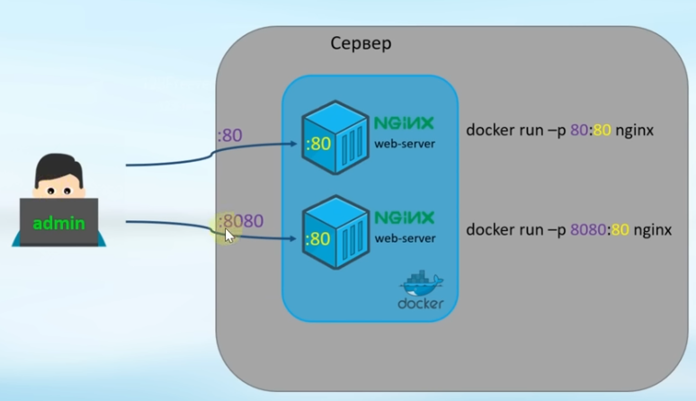

В один контейнер можно пробрасывать несколько портов

```
-p 80:80 -p 8080:8080
```

Суть **port mapping** - проброс порта компьютера на который установлен docker в контейнер. Т. е. допустим в примере выше по ссылке http://localhost:8080 запрос будет перенаправлен в контейнер, который, например, может работать в режиме безымянного bridge и иметь совсем другой IP-адрес. Однако до него можно достучать и без **port mapping**, а просто по его IP-адресу

## Environmental variables

```
docker run -e ...
```

Пример

```
docker run --name CoolDBMS -e MY_SQL_ROOT_PASSWORD = my-secret-pw -d mysql
```

Они будут доступны в контейнере виде переменных среды (переменных командной оболочки)

```
docker exec -it [id] /bin/bash
...
env
...
список переменных окружения bash'а
```

## Постоянные данные (Docker Volumes)

При удалении контейнера все измененные и добавленные данные меняются. Это происходит в т. ч. и при обновлении контейнера.

Есть три способа, как примонтировать директории на сервере (на локальной машине) к контейнеру

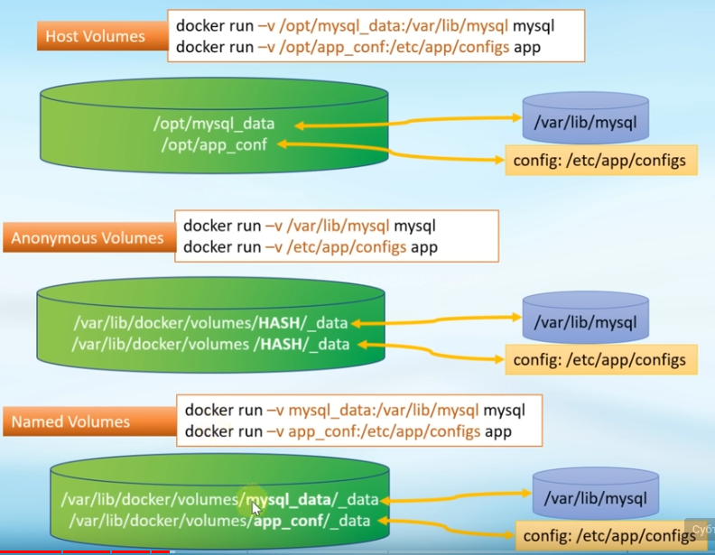

Ну вообще-то их 4


host volume == bind mount

### Good use cases for volumes

Volumes are the preferred way to persist data in Docker containers and services. Some use cases for volumes include:

- **Sharing data among multiple running containers**. If you don't explicitly create it, a volume is created the first time it is mounted into a container. When that container stops or is removed, the volume still exists. Multiple containers can mount the same volume simultaneously, either read-write or read-only. Volumes are only removed when you explicitly remove them.
- When the **Docker host is not guaranteed to have a given directory or file structure**. Volumes help you decouple the configuration of the Docker host from the container runtime.
- When you want to **store your container's data on a remote host or a cloud provider**, rather than locally.
- When you need to **back up, restore, or migrate data from one Docker host to another**, volumes are a better choice. You can stop containers using the volume, then back up the volume's directory (such as `/var/lib/docker/volumes/<volume-name>`).
- When your application requires **high-performance I/O on Docker Desktop. Volumes are stored in the Linux VM rather than the host**, which means that the reads and writes have much lower latency and higher throughput.
- When your application requires **fully native file system behavior on Docker Desktop**. For example, a database engine requires precise control over disk flushing to guarantee transaction durability. Volumes are stored in the Linux VM and can make these guarantees, whereas bind mounts are remoted to macOS or Windows, where the file systems behave slightly differently.

### Good use cases for bind mounts

- In general, you should use volumes where possible. Bind mounts are appropriate for the following types of use case:
- Sharing configuration files from the host machine to containers. This is how Docker provides DNS resolution to containers by default, by mounting /etc/resolv.conf from the host machine into each container.
- Sharing source code or build artifacts between a development environment on the Docker host and a container. For instance, you may mount a Maven target/ directory into a container, and each time you build the Maven project on the Docker host, the container gets access to the rebuilt artifacts.
	
	If you use Docker for development this way, your production Dockerfile would copy the production-ready artifacts directly into the image, rather than relying on a bind mount.

- When the file or directory structure of the Docker host is guaranteed to be consistent with the bind mounts the containers require.

### Good use cases for tmpfs mounts

tmpfs mounts are best used for cases when you do not want the data to persist either on the host machine or within the container. This may be for security reasons or to protect the performance of the container when your application needs to write a large volume of non-persistent state data.

### Основные команды

Посмотреть список volumes:

```
docker volume ls
```

Удалить volume:

```
docker volume rm [полный ID]
```


**При работе с volumes указывать их ID частично недопустимо.**

```
root@debian999:/home/alex/soft/Docker# docker volume ls
DRIVER    VOLUME NAME
local     1c92cb3c11290a6374bb02073f01a6bf3dfa648b691726c2c2195a7a48c3b726
root@debian999:/home/alex/soft/Docker# docker volume rm 1c92
Error response from daemon: get 1c92: no such volume
root@debian999:/home/alex/soft/Docker# docker volume rm 1c92cb3c11290a6374bb02073f01a6bf3dfa648b691726c2c2195a7a48c3b726
1c92cb3c11290a6374bb02073f01a6bf3dfa648b691726c2c2195a7a48c3b726
```

### Примеры использования

Для экспериментов будет использован образ **nginx**. 

Для загрузки образа с DockerHub:

```
docker pull nginx
```


Файл index.html расположен в каталоге `/usr/share/nginx/html`

Скопируем его на жесткий диск для последующей модификации

```
docker cp [id]:/usr/share/nginx/html/index.html /home/alex/index.html
```

При помощи nano изменим его так, чтобы в тэге `<title>` было записано следующее:

```
<title>DOCKER VOLUME TEST</title>
```


#### Host volumes (bind mount)

Создадим каталог `/home/alex/soft/Docker/host_volume1` и скопируем туда измененный файл **index.html**

```
docker run --name nginx_hv -v /home/alex/soft/Docker/host_volume1:/usr/share/nginx/html:ro -d -p 80:80 nginx
```

Здесь **ro** - read only.

Если зайти на страницу 127.0.0.1, то title страницы изменится на DOCKER VOLUME TEST.

Попробуем добавить в index.html фразу "I love docker" на лету в host volume - ничего не изменилось. Чтобы изменения вступили в силу нужно перезапустить контейнер при помощи 

```
docker stop [id/name] / docker start [id/name]

```

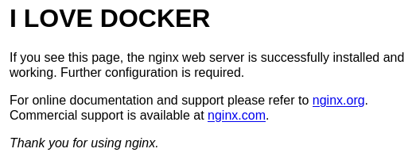

Host volumes не являются истинными volumes и не отображаются при выполнении команды `docker volume ls`

#### Anonymous volumes

```
docker run --name nginx_av -v /usr/share/nginx/html -d -p 80:80 nginx
```

Появился анонимный volume
```
root@debian999:/home/alex/soft/Docker# docker volume ls
DRIVER    VOLUME NAME
local     1c92cb3c11290a6374bb02073f01a6bf3dfa648b691726c2c2195a7a48c3b726
```

Вот где он находится:
```
root@debian999:/home/alex/soft/Docker# ls /var/lib/docker/volumes
1c92cb3c11290a6374bb02073f01a6bf3dfa648b691726c2c2195a7a48c3b726  backingFsBlockDev  metadata.db
```

Попробуем изменить index.html вручную прямо в контейнере:

```
docker exec -i -t nginx_av /bin/bash
```

Приглашение командной строки изменится на **root@cb362bd7bf79**

Для того, чтобы изменить содержимое файла index.html воспользуемся командой **printf**

```
 printf "<html><head></head><body>TEST</body></html>" > index.html
```

Теперь содержимое страницы 127.0.0.1 отображается в браузере как слово "TEST"

Для выхода из контейнера нужно использовать команду **exit**

После удаления контейнера анонимный volume сохраняется

#### Named volume

Попробуем теперь использовать анонимный volume, созданный в прошлом разделе, как именной и подключить его к новому контейнеру nginx. *Предварительно остановим и удалим старый*.

```
docker run --name nginx_nv -v 1c92cb3c11290a6374bb02073f01a6bf3dfa648b691726c2c2195a7a48c3b726:/usr/share/nginx/html -d -p 80:80 nginx
```

Отключим в firefox кэш на время эксперимента:

1. Перейти на страницу "about:config"
2. Установить значения "browser.cache.disk.enable" и "browser.cache.memory.enable" на **false**

При просмотре страницы 127.0.0.1 будет отображаться надпись "TEST".


```
docker volume ls
# :ro - read only
docker run --name web01 -v /some/content:/usr/share/nginx/html:ro -d ngninx
```


<!--
### Host volumes


```
docker run -v [каталог на компе]:[каталог в контейнере] [имя образа]
```
-->

## Сети в Docker

### Основные сетевые режимы

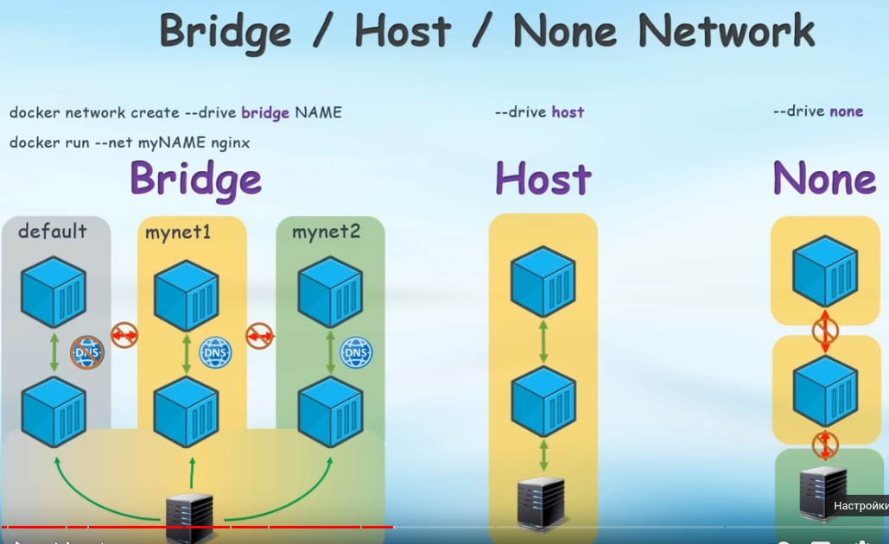

```
--network=bridge/host/none
```

Три основных сетевых режима:

- bridge (по умолчанию) - *используется в 95% случаев*
	+ default
	+ named
- host (ip=ip-адрес хоста)
- none (нет доступа к сети)

#### Безопасная сетевая архитектура

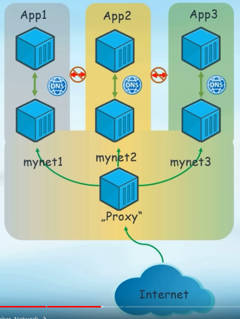

### Особые сетевые режимы
Три особых сетевых режима:

- macvlan
- ipvlan
- overlay

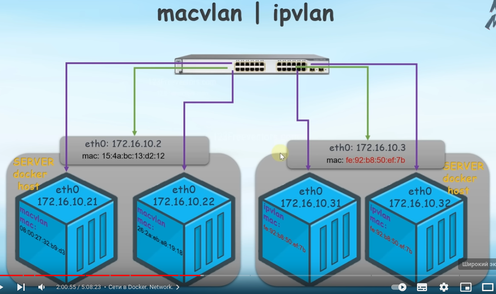

### Режим Bridge

default
Контейнеры могут общаться между собой по IP-адресам

именованный

```
docker network create --drive bridge [network name]
docker run --net [network name]
```

В этом режиме контейнеры могут общаться между собой не только по адресам, но и по именами --name из команды run как по domain name.

defaut network не может общаться с named network

named network не может общаться с named network

### Режим host

используется ip-адрес сети

### Команды

Получить список сетевых интефейсов

```
ip a
```

Посмотреть список сетей Docker

```
docker network ls
```

Создать именованную сеть с драйвером "bridge"

```
docker network create [имя сети]
```

Создать именованную сеть с драйвером "bridge", адресом, маской и маршрутом по умолчанию

```
docker network create --subnet 192.168.0.0/24 --gateway 192.168.10.1 [имя сети]
```

Вывести параметры сети

```
docker network inspect [имя сети]
```

Удалить сеть

```
docker network rm [имя сети]
```

В какой сети находится контейнер:

```
docker inspect [имя контейнера]
```

Запустить контейнер в именованной bridge сети:

```
docker run ... --net [имя сети] ...
```

Подключить контейнер к сети

```
docker network connect [имя сети] [имя контейнера]
```

Контейнер можно подключать к нескольким сетям

Отключить контейнер от сети:

```
docker network disconnect [имя сети] [имя контейнера]
```


### Примеры использования

Для экспериментов использовался контейнер **nicolaka/netshoot**

Команда для его запуска

```
docker run --rm -it --name [имя] nicolaka/netshoot
docker run --rm -it --name [имя] --net [имя сети] nicolaka/netshoot

```

Далее можно использовать, например, такие команды:

```
ip a
ping
```

Информация об интерфейсах до начала эксперимента

```
root@debian999:/home/alex# ip a
1: lo: <LOOPBACK,UP,LOWER_UP> mtu 65536 qdisc noqueue state UNKNOWN group default qlen 1000
    link/loopback 00:00:00:00:00:00 brd 00:00:00:00:00:00
    inet 127.0.0.1/8 scope host lo
       valid_lft forever preferred_lft forever
    inet6 ::1/128 scope host noprefixroute 
       valid_lft forever preferred_lft forever
2: enp3s0: <BROADCAST,MULTICAST,UP,LOWER_UP> mtu 1500 qdisc fq_codel state UP group default qlen 1000
    link/ether 08:bf:b8:b9:df:c3 brd ff:ff:ff:ff:ff:ff
    inet 192.168.1.158/24 brd 192.168.1.255 scope global dynamic noprefixroute enp3s0
       valid_lft 80370sec preferred_lft 80370sec
    inet6 fd01::b485:dd10:42fb:635/64 scope global temporary dynamic 
       valid_lft 271sec preferred_lft 271sec
    inet6 fd01::abf:b8ff:feb9:dfc3/64 scope global dynamic mngtmpaddr noprefixroute 
       valid_lft 271sec preferred_lft 271sec
    inet6 fe80::abf:b8ff:feb9:dfc3/64 scope link noprefixroute 
       valid_lft forever preferred_lft forever
3: docker0: <NO-CARRIER,BROADCAST,MULTICAST,UP> mtu 1500 qdisc noqueue state DOWN group default 
    link/ether 02:42:28:68:5d:95 brd ff:ff:ff:ff:ff:ff
    inet 172.17.0.1/16 brd 172.17.255.255 scope global docker0
       valid_lft forever preferred_lft forever
    inet6 fe80::42:28ff:fe68:5d95/64 scope link 
       valid_lft forever preferred_lft forever

```

Суть эксперимента:

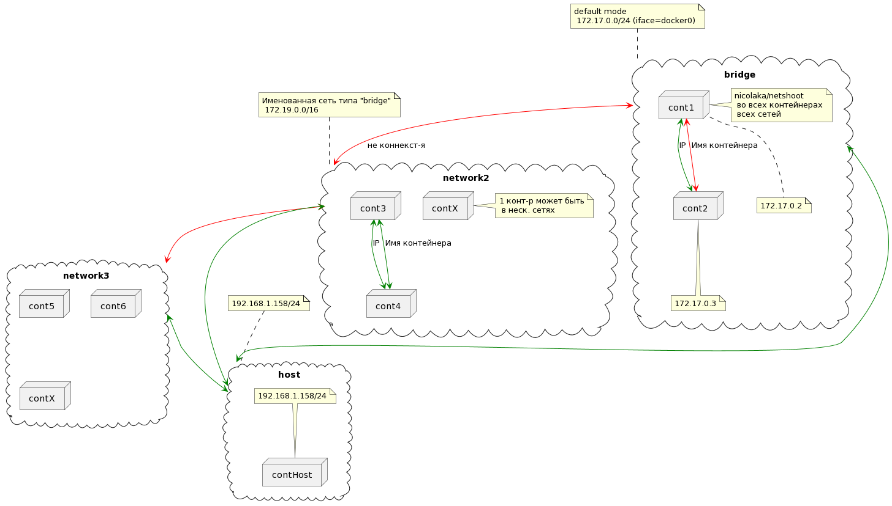

#### Bridge default

```
root@debian999:/home/alex# ip a
1: lo: <LOOPBACK,UP,LOWER_UP> mtu 65536 qdisc noqueue state UNKNOWN group default qlen 1000
    link/loopback 00:00:00:00:00:00 brd 00:00:00:00:00:00
    inet 127.0.0.1/8 scope host lo
       valid_lft forever preferred_lft forever
    inet6 ::1/128 scope host noprefixroute 
       valid_lft forever preferred_lft forever
2: enp3s0: <BROADCAST,MULTICAST,UP,LOWER_UP> mtu 1500 qdisc fq_codel state UP group default qlen 1000
    link/ether 08:bf:b8:b9:df:c3 brd ff:ff:ff:ff:ff:ff
    inet 192.168.1.158/24 brd 192.168.1.255 scope global dynamic noprefixroute enp3s0
       valid_lft 80068sec preferred_lft 80068sec
    inet6 fd01::b485:dd10:42fb:635/64 scope global temporary dynamic 
       valid_lft 277sec preferred_lft 277sec
    inet6 fd01::abf:b8ff:feb9:dfc3/64 scope global dynamic mngtmpaddr noprefixroute 
       valid_lft 277sec preferred_lft 277sec
    inet6 fe80::abf:b8ff:feb9:dfc3/64 scope link noprefixroute 
       valid_lft forever preferred_lft forever
3: docker0: <BROADCAST,MULTICAST,UP,LOWER_UP> mtu 1500 qdisc noqueue state UP group default 
    link/ether 02:42:28:68:5d:95 brd ff:ff:ff:ff:ff:ff
    inet 172.17.0.1/16 brd 172.17.255.255 scope global docker0
       valid_lft forever preferred_lft forever
    inet6 fe80::42:28ff:fe68:5d95/64 scope link 
       valid_lft forever preferred_lft forever
29: veth448ba47@if28: <BROADCAST,MULTICAST,UP,LOWER_UP> mtu 1500 qdisc noqueue master docker0 state UP group default 
    link/ether f2:80:c5:04:a6:cb brd ff:ff:ff:ff:ff:ff link-netnsid 0
    inet6 fe80::f080:c5ff:fe04:a6cb/64 scope link 
       valid_lft forever preferred_lft forever
```

Список интерфейсов для cont1:

```
ip a
1: lo: <LOOPBACK,UP,LOWER_UP> mtu 65536 qdisc noqueue state UNKNOWN group default qlen 1000
    link/loopback 00:00:00:00:00:00 brd 00:00:00:00:00:00
    inet 127.0.0.1/8 scope host lo
       valid_lft forever preferred_lft forever
28: eth0@if29: <BROADCAST,MULTICAST,UP,LOWER_UP> mtu 1500 qdisc noqueue state UP group default 
    link/ether 02:42:ac:11:00:02 brd ff:ff:ff:ff:ff:ff link-netnsid 0
    inet 172.17.0.2/16 brd 172.17.255.255 scope global eth0
       valid_lft forever preferred_lft forever
```


#### Bridge named

Создаем сеть network2:

```
root@debian999:/home/alex# docker network create network2
cd1505bb4b40c52625c14e1bba8dc5fae51a3150ce9fce58452977e45e9703d2

root@debian999:/home/alex# docker network ls
NETWORK ID     NAME       DRIVER    SCOPE
fa61395c68cb   bridge     bridge    local
98a6ceb1fefb   host       host      local
cd1505bb4b40   network2   bridge    local
58ab2a85ed57   none       null      local

root@debian999:/home/alex# ip a
1: lo: <LOOPBACK,UP,LOWER_UP> mtu 65536 qdisc noqueue state UNKNOWN group default qlen 1000
    link/loopback 00:00:00:00:00:00 brd 00:00:00:00:00:00
    inet 127.0.0.1/8 scope host lo
       valid_lft forever preferred_lft forever
    inet6 ::1/128 scope host noprefixroute 
       valid_lft forever preferred_lft forever
2: enp3s0: <BROADCAST,MULTICAST,UP,LOWER_UP> mtu 1500 qdisc fq_codel state UP group default qlen 1000
    link/ether 08:bf:b8:b9:df:c3 brd ff:ff:ff:ff:ff:ff
    inet 192.168.1.158/24 brd 192.168.1.255 scope global dynamic noprefixroute enp3s0
       valid_lft 78563sec preferred_lft 78563sec
    inet6 fd01::b485:dd10:42fb:635/64 scope global temporary dynamic 
       valid_lft 263sec preferred_lft 263sec
    inet6 fd01::abf:b8ff:feb9:dfc3/64 scope global dynamic mngtmpaddr noprefixroute 
       valid_lft 263sec preferred_lft 263sec
    inet6 fe80::abf:b8ff:feb9:dfc3/64 scope link noprefixroute 
       valid_lft forever preferred_lft forever
3: docker0: <BROADCAST,MULTICAST,UP,LOWER_UP> mtu 1500 qdisc noqueue state UP group default 
    link/ether 02:42:28:68:5d:95 brd ff:ff:ff:ff:ff:ff
    inet 172.17.0.1/16 brd 172.17.255.255 scope global docker0
       valid_lft forever preferred_lft forever
    inet6 fe80::42:28ff:fe68:5d95/64 scope link 
       valid_lft forever preferred_lft forever
33: veth17b7c11@if32: <BROADCAST,MULTICAST,UP,LOWER_UP> mtu 1500 qdisc noqueue master docker0 state UP group default 
    link/ether 52:16:d0:e6:26:14 brd ff:ff:ff:ff:ff:ff link-netnsid 1
    inet6 fe80::5016:d0ff:fee6:2614/64 scope link 
       valid_lft forever preferred_lft forever
35: br-cd1505bb4b40: <BROADCAST,MULTICAST,UP,LOWER_UP> mtu 1500 qdisc noqueue state UP group default 
    link/ether 02:42:f3:55:85:b7 brd ff:ff:ff:ff:ff:ff
    inet 172.19.0.1/16 brd 172.19.255.255 scope global br-cd1505bb4b40
       valid_lft forever preferred_lft forever
    inet6 fe80::42:f3ff:fe55:85b7/64 scope link 
       valid_lft forever preferred_lft forever
37: veth44be87b@if36: <BROADCAST,MULTICAST,UP,LOWER_UP> mtu 1500 qdisc noqueue master br-cd1505bb4b40 state UP group default 
    link/ether b6:c8:7d:72:1d:a9 brd ff:ff:ff:ff:ff:ff link-netnsid 0
    inet6 fe80::b4c8:7dff:fe72:1da9/64 scope link 
       valid_lft forever preferred_lft forever

```

Создаем контейнер cont2 bи выводим его интерфейсы:

```
/home/alex/soft/Docker# docker run -it --rm --name cont3 --net network2 nicolaka/netshoot
                    dP            dP                           dP   
                    88            88                           88   
88d888b. .d8888b. d8888P .d8888b. 88d888b. .d8888b. .d8888b. d8888P 
88'  `88 88ooood8   88   Y8ooooo. 88'  `88 88'  `88 88'  `88   88   
88    88 88.  ...   88         88 88    88 88.  .88 88.  .88   88   
dP    dP `88888P'   dP   `88888P' dP    dP `88888P' `88888P'   dP   
                                                                    
Welcome to Netshoot! (github.com/nicolaka/netshoot)
Version: 0.12

                                         


 d19b905f5c03  ~  ip a
1: lo: <LOOPBACK,UP,LOWER_UP> mtu 65536 qdisc noqueue state UNKNOWN group default qlen 1000
    link/loopback 00:00:00:00:00:00 brd 00:00:00:00:00:00
    inet 127.0.0.1/8 scope host lo
       valid_lft forever preferred_lft forever
36: eth0@if37: <BROADCAST,MULTICAST,UP,LOWER_UP> mtu 1500 qdisc noqueue state UP group default 
    link/ether 02:42:ac:13:00:02 brd ff:ff:ff:ff:ff:ff link-netnsid 0
    inet 172.19.0.2/16 brd 172.19.255.255 scope global eth0
       valid_lft forever preferred_lft forever

 d19b905f5c03  ~  

```

Попробуем пропинговать cont3 из cont1

```
fa4680ca7211  ~  ping 172.19.0.2
PING 172.19.0.2 (172.19.0.2) 56(84) bytes of data.
```

Не работает

#### Host

Для contHost

```
ip a
1: lo: <LOOPBACK,UP,LOWER_UP> mtu 65536 qdisc noqueue state UNKNOWN group default qlen 1000
    link/loopback 00:00:00:00:00:00 brd 00:00:00:00:00:00
    inet 127.0.0.1/8 scope host lo
       valid_lft forever preferred_lft forever
    inet6 ::1/128 scope host noprefixroute 
       valid_lft forever preferred_lft forever
2: enp3s0: <BROADCAST,MULTICAST,UP,LOWER_UP> mtu 1500 qdisc fq_codel state UP group default qlen 1000
    link/ether 08:bf:b8:b9:df:c3 brd ff:ff:ff:ff:ff:ff
    inet 192.168.1.158/24 brd 192.168.1.255 scope global dynamic noprefixroute enp3s0
       valid_lft 77617sec preferred_lft 77617sec
    inet6 fd01::b485:dd10:42fb:635/64 scope global temporary dynamic 
       valid_lft 257sec preferred_lft 257sec
    inet6 fd01::abf:b8ff:feb9:dfc3/64 scope global dynamic mngtmpaddr noprefixroute 
       valid_lft 257sec preferred_lft 257sec
    inet6 fe80::abf:b8ff:feb9:dfc3/64 scope link noprefixroute 
       valid_lft forever preferred_lft forever
3: docker0: <BROADCAST,MULTICAST,UP,LOWER_UP> mtu 1500 qdisc noqueue state UP group default 
    link/ether 02:42:28:68:5d:95 brd ff:ff:ff:ff:ff:ff
    inet 172.17.0.1/16 brd 172.17.255.255 scope global docker0
       valid_lft forever preferred_lft forever
    inet6 fe80::42:28ff:fe68:5d95/64 scope link proto kernel_ll 
       valid_lft forever preferred_lft forever
33: veth17b7c11@if32: <BROADCAST,MULTICAST,UP,LOWER_UP> mtu 1500 qdisc noqueue master docker0 state UP group default 
    link/ether 52:16:d0:e6:26:14 brd ff:ff:ff:ff:ff:ff link-netnsid 1
    inet6 fe80::5016:d0ff:fee6:2614/64 scope link proto kernel_ll 
       valid_lft forever preferred_lft forever
35: br-cd1505bb4b40: <NO-CARRIER,BROADCAST,MULTICAST,UP> mtu 1500 qdisc noqueue state DOWN group default 
    link/ether 02:42:f3:55:85:b7 brd ff:ff:ff:ff:ff:ff
    inet 172.19.0.1/16 brd 172.19.255.255 scope global br-cd1505bb4b40
       valid_lft forever preferred_lft forever
    inet6 fe80::42:f3ff:fe55:85b7/64 scope link proto kernel_ll 
       valid_lft forever preferred_lft forever

```

Для основного компьютера

```
root@debian999:/home/alex# ip a
1: lo: <LOOPBACK,UP,LOWER_UP> mtu 65536 qdisc noqueue state UNKNOWN group default qlen 1000
    link/loopback 00:00:00:00:00:00 brd 00:00:00:00:00:00
    inet 127.0.0.1/8 scope host lo
       valid_lft forever preferred_lft forever
    inet6 ::1/128 scope host noprefixroute 
       valid_lft forever preferred_lft forever
2: enp3s0: <BROADCAST,MULTICAST,UP,LOWER_UP> mtu 1500 qdisc fq_codel state UP group default qlen 1000
    link/ether 08:bf:b8:b9:df:c3 brd ff:ff:ff:ff:ff:ff
    inet 192.168.1.158/24 brd 192.168.1.255 scope global dynamic noprefixroute enp3s0
       valid_lft 77629sec preferred_lft 77629sec
    inet6 fd01::b485:dd10:42fb:635/64 scope global temporary dynamic 
       valid_lft 269sec preferred_lft 269sec
    inet6 fd01::abf:b8ff:feb9:dfc3/64 scope global dynamic mngtmpaddr noprefixroute 
       valid_lft 269sec preferred_lft 269sec
    inet6 fe80::abf:b8ff:feb9:dfc3/64 scope link noprefixroute 
       valid_lft forever preferred_lft forever
3: docker0: <BROADCAST,MULTICAST,UP,LOWER_UP> mtu 1500 qdisc noqueue state UP group default 
    link/ether 02:42:28:68:5d:95 brd ff:ff:ff:ff:ff:ff
    inet 172.17.0.1/16 brd 172.17.255.255 scope global docker0
       valid_lft forever preferred_lft forever
    inet6 fe80::42:28ff:fe68:5d95/64 scope link 
       valid_lft forever preferred_lft forever
33: veth17b7c11@if32: <BROADCAST,MULTICAST,UP,LOWER_UP> mtu 1500 qdisc noqueue master docker0 state UP group default 
    link/ether 52:16:d0:e6:26:14 brd ff:ff:ff:ff:ff:ff link-netnsid 1
    inet6 fe80::5016:d0ff:fee6:2614/64 scope link 
       valid_lft forever preferred_lft forever
35: br-cd1505bb4b40: <NO-CARRIER,BROADCAST,MULTICAST,UP> mtu 1500 qdisc noqueue state DOWN group default 
    link/ether 02:42:f3:55:85:b7 brd ff:ff:ff:ff:ff:ff
    inet 172.19.0.1/16 brd 172.19.255.255 scope global br-cd1505bb4b40
       valid_lft forever preferred_lft forever
    inet6 fe80::42:f3ff:fe55:85b7/64 scope link 
       valid_lft forever preferred_lft forever
```


Запустить 2 контейнера в bridge default 
ping each other

какие сетевые интерфейсы есть на компьютере
pine 8.8.8.8
ping each other by ip
ping each other by container name

остается ли сеть после удаления контейнера?


Могут ли контейнеры из разных сетей пинговать друг друга? - нет

----
host режим
убедиться, что список интерфейсов ip -a для компа и хост-режима одинаковый

2 контейнера в хост режиме не могут пинговать друг друга по имени контейнера

### Код диаграммы сетевого взаимодействия

```
@startuml
cloud network1 as "bridge" {

node cont1
node cont2
note right of cont1 : nicolaka/netshoot\n во всех контейнерах\n всех сетей

cont1 <-[#green]-> cont2 : IP
cont1 <-[#red]-> cont2 : Имя контейнера

note bottom of cont1: 172.17.0.2
note bottom of cont2: 172.17.0.3

}

note top of network1 : default mode\n 172.17.0.0/24 (iface=docker0)

cloud network2 as "network2" {

node cont3
node cont4

cont3 <-[#green]-> cont4 : IP
cont3 <-[#green]-> cont4 : Имя контейнера
node contX

note right of contX : 1 конт-р может быть\n в неск. сетях

}

cloud network3 as "network3" {

node cont5
node cont6

node contX1 as "contX"
}

note top of network2 : Именованная сеть типа "bridge"\n 172.19.0.0/16

network1 <-[#red]-> network2: не коннекст-я
network2 <-[#red]-> network3

cloud host {
node contHost
note top of contHost : 192.168.1.158/24
}
note top of host : 192.168.1.158/24

network2 <-[#green]-> host
network3 <-[#green]-> host
network1 <-[#green]-> host

@enduml
```

## Создание собственных образов (images) контейнеров

Cуществует 2 способа создания контейнеров:

1. Путем изменения запущенного контейнера и его последующего сохранения в образ в ручном (интерактивном) режиме
2. Путем компиляции **dockerfile** в образ (image)

### Компиляция Dockerfile в Image

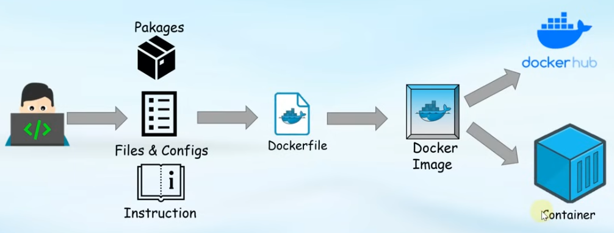

#### Структура Dockerfile

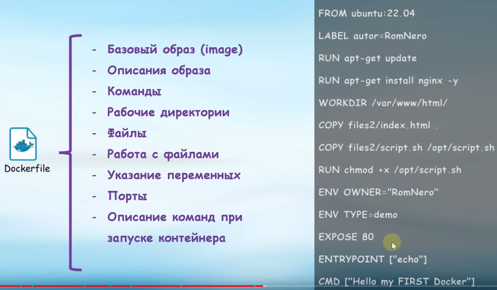

Некоторые примечания:

- FROM - указание базового образа
- RUN - выполнение команды
- COPY - копирование файла в контейнер
- Переменные - environment variables
- Команда Expose (проброс портов) носит информационный характер (ни на что не влияет)

#### Пример №1 (Hello world)

Создадим каталог для контейнера. В нем создадим файл `dockerfile` (*без расширения*).

Контейнер всегда создается на основе какого-то другого контейнера. Для этого используется команда FROM. При этом можно указывать версию базового контейнера.

Содержимое Dockerfile:

```
FROM ubuntu:22.04
CMD echo "Hello world"
```

Далее выполняем в этом каталоге команду:

```
docker build .
```

Будет создан docker image

Для его просмотра нужно воспользоваться командой

```
docker images
```

Чтобы указать ему версию (тэг) нужно воспользоваться командой

```
docker tag [image id] [Название контейнера]:[Версия]
```

При этом [image id] брать из вывода `docker images`


#### Некоторые команды

Просмотр списка images

```
docker images
```

Сохранить image в файл:

```
docker save [Название image] > [имя файла].tar
```

Загрузить image из файла:

```
docker load < busybox.tar.gz
```

Удалить image

```
docker rmi [image name]
```

Создать image из dockerfile и одновременно указать тэг

```
docker build -t [Название контейнера]:[Версия] .
```

#### CMD & ENTRYPOINT

CMD указывает, какую команду надо выполнить при запуске контейнера.

Альтернативный формат записи CMD (exec-режим)

```
CMD ["echo", "Hello world"]
```

Это так называемый [exec-режим запуска](https://habr.com/ru/companies/slurm/articles/329138/). В отличие от **shell-режима**, команда будет выполняться прямо в контейнере. В shell-режиме же в контейнере будет запущен процесс командной оболочки, в котором будет выполнена команда. 

*Exec-режим является рекомендуемым*. Однако существенным его минусом является то, что при этом нельзя использовать переменные окружения, а также такие конструкции как, например, "*.jar" и так далее. 

[Некоторые факты](https://habr.com/ru/companies/slurm/articles/329138/)

- Требуется определить хотя бы одну инструкцию (ENTRYPOINT или CMD) (для запуска).
- Если во время выполнения определена только одна из инструкций, то и CMD и ENTRYPOINT будут иметь одинаковый эффект.
- И для CMD, и для ENTRYPOINT существуют режимы shell и exec.
- Режим exec является рекомендуемым.
- Нет оболочки? Нет переменных окружения.


##### Одновременное использование

- Если вы используете режим shell для ENTRYPOINT, CMD игнорируется
- При использовании режима exec для ENTRYPOINT аргументы CMD добавляются в конце.
- При использовании режима exec для инструкции ENTRYPOINT необходимо использовать режим exec и для инструкции CMD. Если этого не сделать, Docker попытается добавить sh -c в уже добавленные аргументы, что может привести к некоторым непредсказуемым результатам.

##### Переопределение ENTRYPOINT и CMD во время выполнения

Флаг --entrypoint может быть использован, чтобы переопределить инструкцию ENTRYPOINT:

```
docker run --entrypoint [my_entrypoint] test  
```


Все, что следует после названия образа в команде docker run, переопределяет инструкцию CMD:

```
docker run test [command 1] [arg1] [arg2]  
```


Все вышеперечисленные факты справедливы, но имейте в виду, что разработчики имеют возможность переопределять флаги в команде docker run. 

##### Как их использовать?

Используйте ENTRYPOINT, если вы не хотите, чтобы разработчики изменяли исполняемый файл, который запускается при запуске контейнера. Вы можете представлять, что ваш контейнер – исполняемая оболочка. Хорошей стратегией будет определить стабильную комбинацию параметров и исполняемого файла как ENTRYPOINT. Для нее вы можете (не обязательно) указать аргументы CMD по умолчанию, доступные другим разработчикам для переопределения.

```
FROM alpine  
ENTRYPOINT ["ping"]  
CMD ["www.google.com"]  
```

Запуск с параметрами по умолчанию:

```
$ docker run test
PING www.google.com (172.217.7.164): 56 data bytes  
64 bytes from 172.217.7.164: seq=0 ttl=37 time=0.306 ms
```

Переопределение CMD собственными параметрами:

```
$ docker run test www.yahoo.com
PING www.yahoo.com (98.139.183.24): 56 data bytes  
64 bytes from 98.139.183.24: seq=0 ttl=37 time=0.590 ms  
```

#### Проброс портов

Автоматически пробросить все порты, указанные в **dockerfile** при помощи `EXPOSE`

```
docker run -P [image]
```


### Создание image путем изменения запущенного контейнера в интерактивном режиме

[Источник](https://www.dataset.com/blog/create-docker-image/)

**Создать контейнер из образа:**

```
docker create --name [название контейнера] -p 80:80 [название образа]
```


**Проверить список images:**

```
docker images -a
```

**Проверить список контейнеров:**

```
docker ps -a
```

**Запустить контейнер из image:**

```
docker start [название контейнера]
```

**Изменить запущенный контейнер:**

```
docker exec -it [Название контейнера] /bin/bash
docker cp [Путь к файлу] [Название контейнера]:[Путь к файлу в контейнере]
```

**Создать образ из запущенного контейнера:**

```
docker commit [Запущенный контейнер] [Тэг (новое название)]
docker commit --author amit.sharma@sentinelone.com nginx_base authored
docker commit --message 'this is a basic nginx image' nginx_base mmm
docker commit --change='CMD ["nginx", "-T"]' nginx_base conf_dump
```

При помощи `--change` можно изменять:

- CMD
- ENTRYPOINT
- ENV
- EXPOSE
- LABEL
- ONBUILD
- USER
- VOLUME
- WORKDIR

Значения дополнительных поля можно просматривать при помощи `docker inspect [Контейнер]`

**Остановить базовый контейнер:**

```
docker stop nginx_base
```
